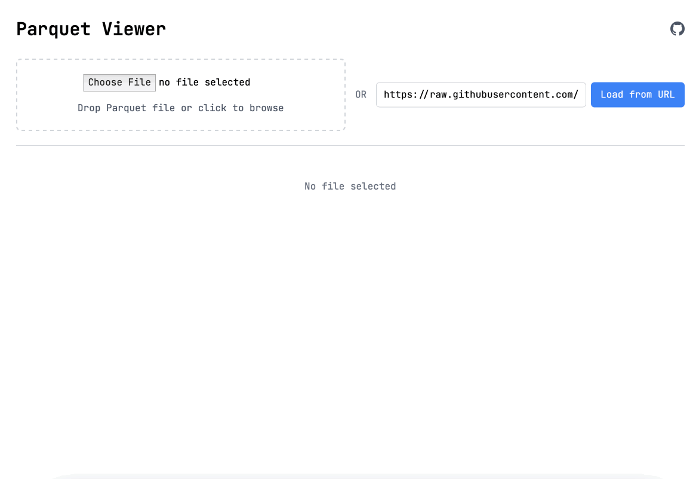

# Parquet Viewer

Online at: https://parquet-viewer.xiangpeng.systems

### Features

- Ask questions about Parquet data with natural language ✅
- View Parquet metadata ✅
- Explore Parquet data with SQL ✅
- View Parquet files from local file system, S3, and URLs ✅
- Everything runs in the browser, no data upload ✅

### Demo




## Development

It compiles [parquet-rs](https://github.com/apache/arrow-rs) to WebAssembly and uses it to explore Parquet files, [more details](https://blog.haoxp.xyz/posts/parquet-viewer/).


Checkout the awesome [Leptos](https://github.com/leptos-rs/leptos) framework.

```bash
trunk serve --open

trunk build --release
```

## License

Licensed under either of

 * Apache License, Version 2.0, ([LICENSE-APACHE](LICENSE-APACHE) or http://www.apache.org/licenses/LICENSE-2.0)
 * MIT license ([LICENSE-MIT](LICENSE-MIT) or http://opensource.org/licenses/MIT)

at your option.
