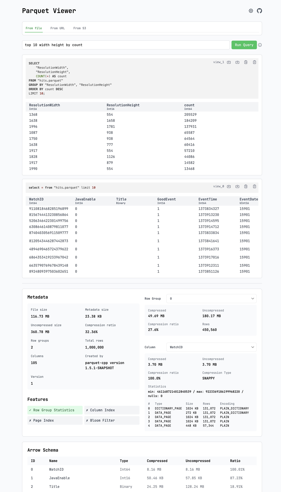

# Parquet Viewer

Online at: https://parquet-viewer.xiangpeng.systems

### Features

- Query parquet data with SQL (if you're resistance) ✅
- Query parquet data with natural language through LLM (if you're enlightened) ✅
- View Parquet metadata ✅
- View Parquet files from anywhere -- local file, S3, or any URLs ✅
- Everything runs in the browser, no server, no external dependencies, just a web page ✅

### Demo



### Headless mode
Despite being a battery-included web app, it can also be used as a headless tool, especially helpful when working with LLM tools.

Like command args for CLI tools, you can pass url params to control the behavior of the app.

For example, [this link](https://parquet-viewer.xiangpeng.systems/?tab=url&url=https%3A%2F%2Fraw.githubusercontent.com%2Ftobilg%2Fpublic-cloud-provider-ip-ranges%2Fmain%2Fdata%2Fproviders%2Fall.parquet&query=SELECT%20%22cloud_provider%22%2C%20%22region%22%2C%20SUM(%22ip_address_cnt%22)%20AS%20%22ip_count%22%20FROM%20%22all%22%20GROUP%20BY%20%22cloud_provider%22%2C%20%22region%22%20ORDER%20BY%20%22ip_count%22%20DESC%3B&export=csv) tells parquet-viewer to 

(1) load a file from a url, 

(2) run a SQL query (or natural language if you like), 

(3) export the results to a CSV file. 

Most of the query params are reflected in the URL as you operate on the app, so you can simply share the URL with others to reproduce your findings.

Adding `export=csv` or `export=parquet` to the URL will export the query result to a CSV/Parquet file.


## Development

It compiles [Parquet](https://github.com/apache/arrow-rs), [Arrow](https://github.com/apache/arrow-rs), [Datafusion](https://github.com/apache/datafusion), [OpenDAL](https://github.com/apache/opendal) to WebAssembly and uses it to explore Parquet files, [more details](https://blog.haoxp.xyz/posts/parquet-viewer/).


Checkout the awesome [Leptos](https://github.com/leptos-rs/leptos) framework.

```bash
trunk serve --open

trunk build --release
```

## License

Licensed under either of

 * Apache License, Version 2.0, ([LICENSE-APACHE](LICENSE-APACHE) or http://www.apache.org/licenses/LICENSE-2.0)
 * MIT license ([LICENSE-MIT](LICENSE-MIT) or http://opensource.org/licenses/MIT)

at your option.

Be aware that most of the code is generated by AI, resistance is futile.
