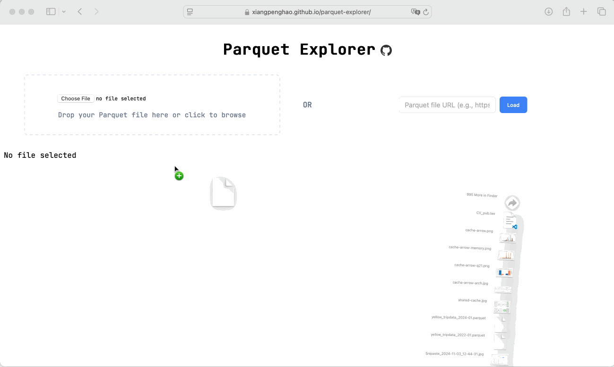

# Parquet Explorer

Online at: https://xiangpenghao.github.io/parquet-explorer

It compiles [parquet-rs](https://github.com/apache/arrow-rs) to WebAssembly and uses it to explore Parquet files.




## Development

Checkout the awesome [Leptos](https://github.com/leptos-rs/leptos) framework.

```bash
trunk serve --open

trunk build --release
```